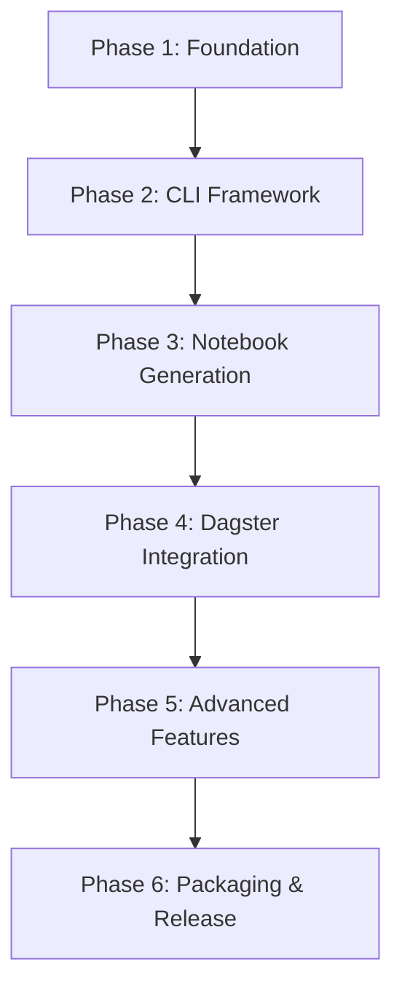

# Dagmar Implementation Plan

This document outlines the phased implementation approach for the Dagster ↔ marimo Paired Notebook CLI tool (`dagmar`). The implementation is broken down into 6 sequential phases that build upon each other, ensuring a solid foundation while delivering incremental value.

## Overview

**Project Goal**: Create a PyPI-ready CLI tool that enables data engineers to scaffold, run, and round-trip "paired marimo notebooks" alongside Dagster repos, making experimentation feel notebook-native while keeping executions and artifacts visible in Dagster's UI.

## Implementation Phases

### [Phase 1: Foundation & Core Infrastructure](./phase-1-foundation.md)
**Duration**: 1-2 weeks  
**Goal**: Establish the basic project structure, configuration system, and core utilities

**Key Deliverables**:
- Project scaffolding with proper Python packaging
- Configuration management system (`dagmar.yaml`)
- Core utilities (logging, errors, validation)
- Basic CLI framework with Typer
- Development environment setup

### [Phase 2: CLI Framework & Basic Commands](./phase-2-cli.md)
**Duration**: 1-2 weeks  
**Goal**: Implement core CLI commands and user experience

**Key Deliverables**:
- Complete CLI command structure
- `dagmar init` command (existing and new projects)
- `dagmar doctor` diagnostics
- `dagmar clean` utility
- Basic help and error handling

### [Phase 3: Notebook Generation & Templates](./phase-3-notebooks.md)
**Duration**: 2-3 weeks  
**Goal**: Create the notebook scaffolding system and template engine

**Key Deliverables**:
- Jinja2 template system for marimo notebooks
- `dagmar scaffold` command
- Multiple notebook templates (default, minimal, ML)
- Template variable system
- Notebook validation and testing

### [Phase 4: Dagster Integration & GraphQL](./phase-4-integration.md)
**Duration**: 2-3 weeks  
**Goal**: Implement Dagster connectivity and GraphQL operations

**Key Deliverables**:
- GraphQL client with authentication
- `dagmar discover` command
- `dagmar run` command
- Run status polling and management
- Asset and job discovery

### [Phase 5: Advanced Features & Polish](./phase-5-advanced.md)
**Duration**: 2-3 weeks  
**Goal**: Add advanced functionality and user experience improvements

**Key Deliverables**:
- `dagmar dev` sidecar development environment
- `dagmar export` with metadata attachment
- Performance monitoring and metrics
- State management across notebook cells
- Error recovery and retry mechanisms

### [Phase 6: Packaging, Testing & Documentation](./phase-6-packaging.md)
**Duration**: 1-2 weeks  
**Goal**: Prepare for production release

**Key Deliverables**:
- Comprehensive test suite (unit, integration, e2e)
- Security review and hardening
- Complete documentation
- PyPI packaging and release pipeline
- CI/CD setup

## Success Criteria

Each phase must meet these criteria before proceeding to the next:

1. **Code Quality**: All code passes type checking (mypy), linting (ruff), and basic tests
2. **Documentation**: Phase-specific documentation is complete and accurate
3. **Integration**: New features integrate cleanly with existing functionality
4. **Testing**: Core functionality has test coverage
5. **User Experience**: CLI commands provide clear feedback and error messages

## Dependencies Between Phases

## Risk Mitigation

- **Early Validation**: Each phase includes validation against the original requirements
- **Incremental Testing**: Continuous integration from Phase 1
- **User Feedback**: Early access to core functionality for feedback
- **Fallback Plans**: Each phase has defined rollback points

## Timeline

**Total Estimated Duration**: 9-15 weeks  
**Critical Path**: Phases 1-4 (core functionality)  
**Buffer Time**: 2-3 weeks for integration and polish

## Next Steps

1. Review and approve this implementation plan
2. Set up development environment and tooling
3. Begin Phase 1 implementation
4. Establish regular review checkpoints between phases
